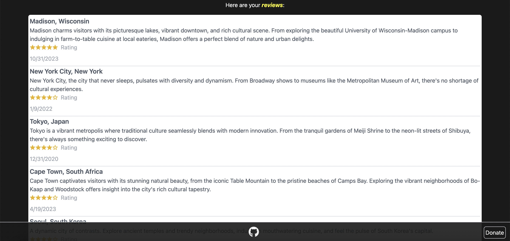
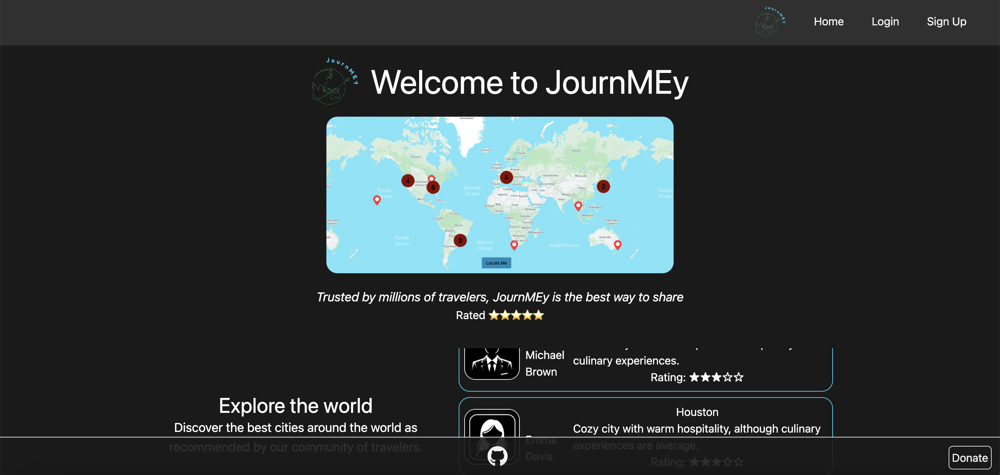

# Project 3: JournMEy

## Description 
JournMEy is an app designed for adventurous travelers seeking unique journeys and insightful recommendations. With JournMEy, travelers can discover city reviews contributed by fellow adventurers from around the globe. Whether you're a seasoned traveler or embarking on your first journey, JournMEy can assist you in planning your next adventure.

## Table of Contents

- [Overview](#overview)
- [Target Audience](#target-audience)
- [How to Use](#how-to-use)
- [Benefits](#benefits)
- [Tech Stack](#tech-stack)
- [Contributors](#contributors)
- [Contact](#contact)

## Overview

Similar to how individuals rely on reviews to make informed decisions about dining, we envisioned an app that could help travelers find reviews about cities, helping them decide on their next journey destination. Through the app, users can access city reviews from around the world, favorite cities they wish to visit, revisit their own previous reviews, and contribute new reviews for the benefit of others.

## Target Audience

The journMEy app aims to provide personalized travel experiences for a wide range of travelers, including:
1. Travel Enthusiasts: Those who love exploring new places.
2. Backpackers: Budget travelers seeking adventurous experiences.
3. Solo Travelers: Individuals who enjoy independent travel.
4. Family Travelers: Families looking for kid-friendly destinations.
5. Adventure Seekers: Thrill-seekers seeking exciting experiences.
6. Cultural Explorers: People interested in diverse cultures and cuisines.
7. Business Travelers: Professionals traveling for work purposes.
8. Photography Enthusiasts: Photographers capturing travel moments.

## How to Use

### 1. Login or Sign Up

Access the app using your credentials to: LINKLINKLINK

### 2. Map

Read reviews about different cities by viewing the world map. There is also a search bar for users to find a particular city.

### 3. Add Reviews

Contribute by adding reviews about the cities you have visited, allowing other travelers to learn about what each city has to offer.

### 4. Explore Favorites

Discover the cities you've marked for your next journey.

### 5. Review your Visits

View the cities you've explored and shared your experiences about.

### 6. Logout

Securely sign out from your session when you're done.

## Tech Stack

- MongoDB
- Mongoose ODM
- Express.js
- React.js
- Node.js
- GraphQL API
- JWT Authentication 
- React Leaflet
- Tailwind CSS

## Contributors

Special thanks to the contributors who have helped in building and improving the Expense Insight Tracker:

- [Keng Thao](https://github.com/Kthao29)
- [Willie Jones](https://github.com/Liiv-Dev)
- [Bao Xiong](https://github.com/bxiong34)

If you have any questions or need assistance, please contact the contributors through GitHub.